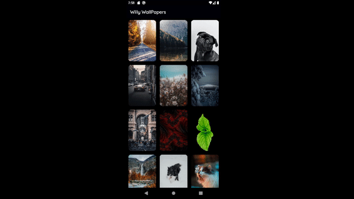
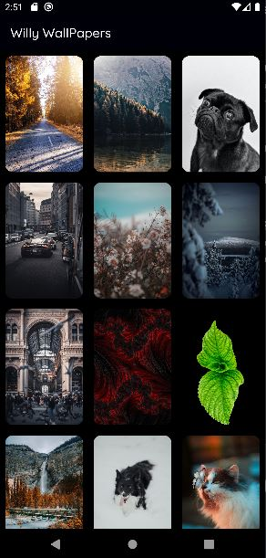
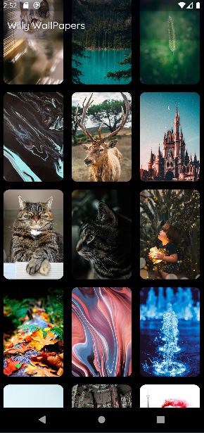
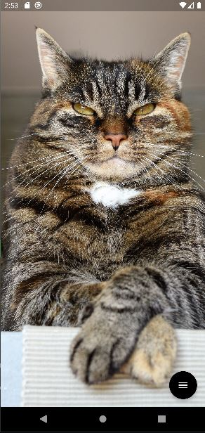
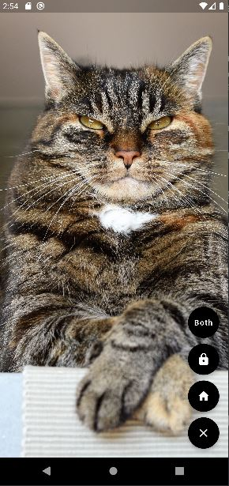

<samp>

# 
Wily WallPapers

# 
Mobile: IOS | Android

## 
Flutter

- #### The initial intention would be to create a wallpaper app with 30 images, and post it on the PlayStore with ads, but the project did not go as expected because of some limitations of Flutter related to Android and IOS. Because of these limitations I preferred to learn Android native to do it better than this one. It works to set the wallpapers, but it wasn't the quality I wanted. Hope you like it!

## 
Mobile Version: Android | IOS

## 
@luanbatistadev

 

<samp>

<h2 align="center">
  Open Source
</h2>

  Copyright © 2021-present, Luan Batista.

Willy WallPapers <a href="/LICENSE">is MIT licensed 💖</a>

</samp>